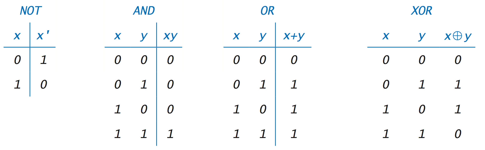
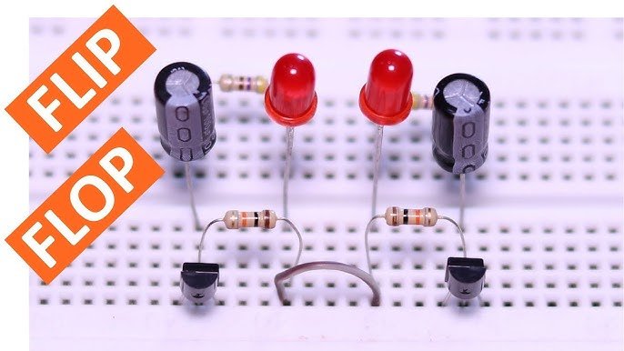
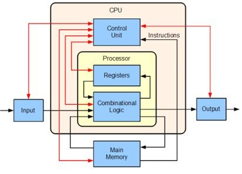
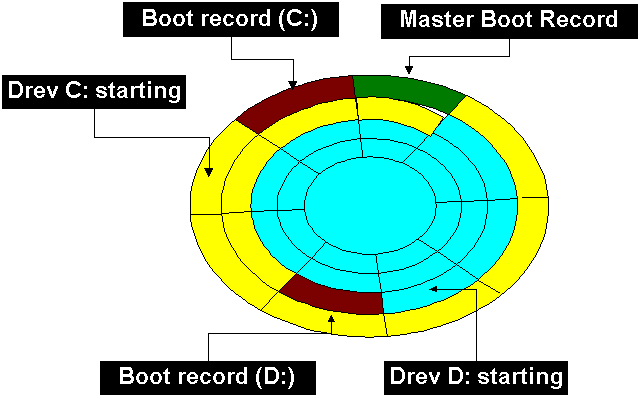
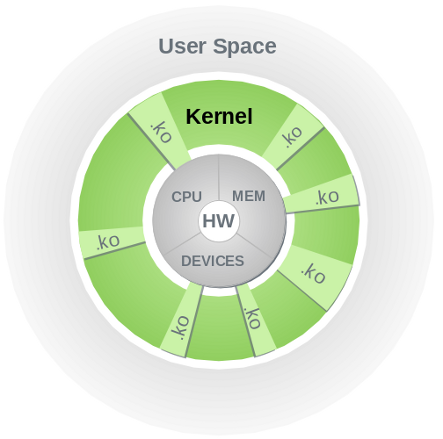

+++
title = "Digital Machine Layer By Layer"
date = 2024-07-05
description = "This post gives a layer by layer information of how humans make sand think."

[taxonomies]
tags = ["processor", "kernel", "compiler"]

[extra]
thumbnail = "cpu-brain.jpeg"
toc = true
quick_navigation_buttons = true
+++

What happens when I write a line of code? Where does it run? How does it make the text "crash and burn" appear in my terminal when I am frustrated with my bugs and do random typing? Following gives a basic idea from scratch of all this.

# Processor

## Logic - modelled using tautology
- There are statements which can be true or false.
- There are operations which can take certain statements and result into new statements.
- AND, OR and INVERSE are the three base operations.
- They can be combined to create new ones such as NAND, XOR, NOR.

[(source)](https://introcs.cs.princeton.edu/java/71boolean/images/truth-table.png)

## Physical Layer - Translating logic into hardware
- Electricity is the medium and voltage is what defines concept of discrete values based on threshold.
- Transistors are measurement device for the voltage that represent statement values - 0/1.
- Integrated circuits are connected transistors and capacitors (regulation and stability purpose) that design the desired logical operations.
- Flip-Flops are integrated circuits that can persist one value (1 bit information) in form of held voltages. This is what provides persistence.
- Registers (logical) -
    - Storage - constructed using multiple flip-flops connected together in a specific configuration. For example, an 8-bit register would consist of eight flip-flops, each capable of storing one bit of data.
    - Control logic - a dedicated IC to control the read and write logic for values in register.

[(source)](https://i.ytimg.com/vi/nSXSafk4SjA/hq720.jpg?sqp=-oaymwEhCK4FEIIDSFryq4qpAxMIARUAAAAAGAElAADIQj0AgKJD&rs=AOn4CLDuHZz92Ymdap6tAwNp_KyCAjwuNA)

## Logical layer (CPU)
Processor encapsulates following things in one package with which software interacts.
- Memory - Multiple types (cache, main etc.), mostly flip-flops made into SRAM.
- Registers - Smallest pieces of information storage and instruction definition.
- Microcode - low-level code (binary code) that directly controls the operation of the processor's hardware components by generating control signals that dictate the flow of electric current within the processor. It serves as a bridge between the higher-level instructions from the processor's instruction set architecture (ISA) and the physical hardware components of the processor.
- Instruction-Set - Higher level instructions (MOV, ADD, DUB, JMP etc.) that programs can use to interact with the hardware. This is synchronous programming.
- Interrupts - This adds the element of asynchrony in the instruction execution. Any device (program or hardware, internal or external) can send an interrupt. There are dedicated ICs for detecting, prioritising and handling interrupts by mapping them to their handlers. Microcode has the logic for all this, essentially event loop type thing, freeze current thing into program-counter and stack into registers and execute the next ting.
- Special instructions - Most processors also come with atomic instructions to synchronisation (consistency of data among running tasks opn shared processor) to the programmes. These instructions are essentially hardware bound coupled instructions such as compare-and-swap.
- Architectures - RISC (ARM, SPARC) and CISC (x86)

[(source)](https://www.linkedin.com/pulse/decoding-cpu-instruction-set-architecture-isa-vasuki-shankar/)

# Programme

## Running the machine (booting - short for bootstrapping)
- When power flows, a specific register (memory address) called “Reset Vector” starts the execution of few instructions. Very first one is POST(Power-On Self-Test) which checks all the hardware components for health and initialises all of them.
- Then another memory location called MBR (Master Boot Record) is executed to find the boot-loader program and transfer the execution to that. Boot-loader initialises additional hardware components and loads the kernel into memory for execution.
- Kernel is executed which furthers sets up device drivers and system configurations. Once ready kernel hands over the execution to the user-space processes.
- User-space processes may involve remaining OS functionalities such as system services and GUI. Now user can start interacting with the machine.

[(source)](https://scx010c073.blogspot.com/2012/03/mbr-master-boot-record.html)

## Using the processor - setting the foundation, i.e. Kernel
- Kernel is the programme that wraps processor's low-level instruction-set and provides a higher lever programming API to utilise various capabilities of the processor. Compared to writing programmes for tasks directly using processor's instruction set, a kernel helps in two things -
    - Boilerplate for complex functionalities - Functionalities such as multi-tasking, persistence and networking are common to most modern tasks. For each task to implement them is duplicate work and can be delegated to one single program, i.e. kernel.
    - Security and guarantees - Above functionalities often require use of processor by untrusted parties. In such cases, ensuring that any such user does not cause any harm to the processor or to other user's tasks requires routing all requests to use the hardware via a reliable programme layer, i.e. kernel.
- Kernel provides above mentioned security and guarantees by utilising hardware's concepts such as trap-table, timer interrupt and atomic instructions to provide privileged instructions, process switching and concurrency respectively.
- APIs -
    - Process API - A virtual construct for processor's running time. APIs like `fork()`, `wait()`, `exit()`, `kill()`, `exec()` provide ways for programmer to use processor's running time for multiple tasks at a time.
    - Memory API - A construct for machine's embedded memory registers. APIs like `malloc()` and `free()` provide ways for programmer to control what registers to  access and update and how.
    - File Systems API - A construct for managing a virtual structure for information. APIs like `open()`, `close()`, `read()` and `write()` provide ways for programmer to modify structures and read and write data from them. Most kernels use the same APIs to manage devices which add capabilities to the system. The reason for this is that device management and data transfer is same as a virtual structure management and for control commands for specific devices `ioctl()` API is there.
    - Networking API - A construct for managing connections with other machines. APIs like `socket`, `send()` and `recv()` provide ways for programmer to create connections and do datab transfer.

[(source)](https://drivers.suse.com/doc/SolidDriver/Kernel_Modules.html)

## Writing programs using a compiler
- This is the layer where programmes for applications / tasks are written.
- Interfacing with kernel APIs require understanding the development environment they support. In case of Linux kernel, this includes -
    - use C programming language
    - a C compiler such as GCC
    - interfaces for kernel API, exposed for this development env (C header files for Linux)
    - the interface itself has an implementation in the kernel source code and can be in any language / development environment as long as kernel has provided an interface for the programmer's dev env to kernel's implementation dev env.
- Such development environments may not always be the best to use for a task because while they are simpler and more functional to use than processor's instruction-set, they still can be simplified for some common aspects of application programming that most programmers do. Ex.-
    - Memory management - It has multiple parts -
        - Ensuring that memory allocation and deallocation is happening correctly without having the programmer manulally keep an eye on it to avoid memory leaks or memory misses.
        - A common way to provide this is abstracting the concept of memory behing another concept called "variable".
        - Once abstracted in the form of variables, memory can then have more features such as what type of data it holds and what kind of mutability it supports or what its lifecycle is.
    - Data structures - Providing implementations for data structures commonm to most tasks such a list, stack, queue, map etc.
    - Text manipulation - A lot of tasks require dealing with text in some input or output and thus building and updating texts in various forms is a common requirement.
    - Concurrency - While kernel provides concurrency as a feature with the help of processor's interrupt and threads, there are more forms of concurrency paradigms such as event-loop, async and coroutines that can be better suited for most tasks in terms of ease of development and performance output.
- There are development environments providing these features out of the box by building on top of the kernel's out of box development environments and are commonly called "high level programming languages". Ex.- Java and Rust are such high level languages. Interestingly, if you would check how these languages were written in, you would find that they were written in the same language which is circular. How this works is that most language creators, write a bare minimum implementation of thew language's base features and rules set using the kernel's development environment and then use that to write majority of the other set of the features using that very basic set. It's called `bootstrapping`.
---
The above should give a good idea of what one actually is manipulating with each line of code one writes and how.

---