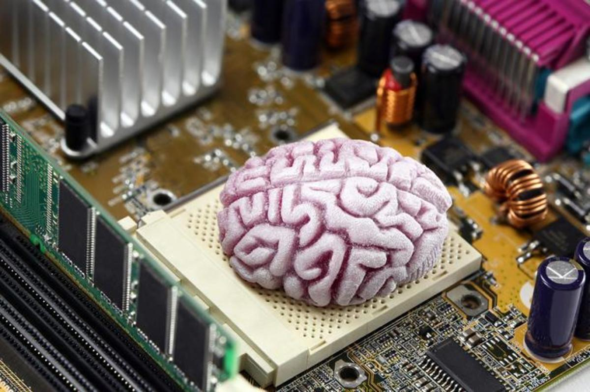

+++
title = "Digital Machine Layer By Layer"
date = 2024-07-05
description = "This post gives a layer by layer information of how humans make sand think."

[taxonomies]
tags = ["processor"]

[extra]
toc = true
quick_navigation_buttons = true
+++

# Processor

- **Logic** - modelled using tautology -
    - There are statements which can be true or false.
    - There are operations which can take certain statements and result into new statements.
    - AND, OR and INVERSE are the three base operations.
    - They can be combined to create new ones such as NAND, XOR, NOR.
- **Physical Layer** - Translating logic into hardware -
    - Electricity is the medium and voltage is what defines concept of discrete values based on threshold.
    - Transistors are measurement device for the voltage that represent statement values - 0/1.
    - Integrated circuits are connected transistors and capacitors (regulation and stability purpose) that design the desired logical operations.
    - Flip-Flops are integrated circuits that can persist one value (1 bit information) in form of held voltages. This is what provides persistence.
    - Registers (logical) -
        - Storage - constructed using multiple flip-flops connected together in a specific configuration. For example, an 8-bit register would consist of eight flip-flops, each capable of storing one bit of data.
        - Control logic - a dedicated IC to control the read and write logic for values in register.
- **Logical layer (CPU)** - Processor encapsulates following things in one package with which software interacts.
    - Memory - Multiple types (cache, main etc.), mostly flip-flops made into SRAM.
    - Registers - Smallest pieces of information storage and instruction definition.
    - Microcode - low-level code (binary code) that directly controls the operation of the processor's hardware components by generating control signals that dictate the flow of electric current within the processor. It serves as a bridge between the higher-level instructions from the processor's instruction set architecture (ISA) and the physical hardware components of the processor.
    - Instruction-Set - Higher level instructions (MOV, ADD, DUB, JMP etc.) that programs can use to interact with the hardware. This is synchronous programming.
    - Interrupts - This adds the element of asynchrony in the instruction execution. Any device (program or hardware, internal or external) can send an interrupt. There are dedicated ICs for detecting, prioritising and handling interrupts by mapping them to their handlers. Microcode has the logic for all this, essentially event loop type thing, freeze current thing into program-counter and stack into registers and execute the next ting.
    - Architectures - RISC (ARM, SPARC) and CISC (x86)

# Programme

- **Running the machine (booting - short for bootstrapping)** -
    - When power flows, a specific register (memory address) called “Reset Vector” starts the execution of few instructions. Very first one is POST(Power-On Self-Test) which checks all the hardware components for health and initialises all of them.
    - Then another memory location called MBR (Master Boot Record) is executed to find the boot-loader program and transfer the execution to that. Boot-loader initialises additional hardware components and loads the kernel into memory for execution.
    - Kernel is executed which furthers sets up device drivers and system configurations. Once ready kernel hands over the execution to the user-space processes.
    - User-space processes may involve remaining OS functionalities such as system services and GUI. Now user can start interacting with the machine.

---